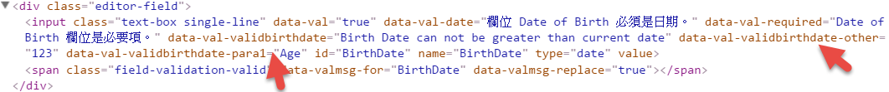

MVC4 表單驗證
===

# 使用DataAnnotation提供的內建驗證
MVC的DataAnnotation提供了內建的驗證, 只要引入後使用DataType定義好, 就會自動做前後端的驗證.

### 使用DataType=Email的範例
```
//Model
[DataType(DataType.EmailAddress)]
[StringLength(128)]
[Required]
public string Email { get; set; }
//HTML
<div class="editor-label">
    @Html.LabelFor(model => model.Email)
</div>
<div class="editor-field">
    @Html.EditorFor(model => model.Email)
    @Html.ValidationMessageFor(model => model.Email)
</div>
```

### 使用ModelState.AddError
MVC也提供了在POST資料後, 在後端可以加入自己的商業邏輯判斷後, 並自訂錯誤訊息顯示. 而且一旦執行了AddError, `ModelState.IsValid`就一定會是false.

```
//Model
public string AddErrorEmail { get; set; }
//Controller
public ActionResult Index(User model)
{
    if (model.AddErrorEmail.Equals("t@gmail.com"))
    {
        ModelState.AddModelError("ModelStateError", "Email不可以是t@gmail.com");
    }
}
//Html
<div class="editor-label">
    @Html.LabelFor(model => model.AddErrorEmail)
</div>
<div class="editor-field">
    @Html.EditorFor(model => model.AddErrorEmail)
    @Html.ValidationMessage("ModelStateError")
</div>
```

---
# 建立客製化前端驗證
建立驗證輸入的生日不可大於今日日期.

### 建立自訂屬性, 並繼承IClientValidatable
```
public sealed class ValidBirthDate : ValidationAttribute, IClientValidatable
{
}
```

### 實作IClientValidatable
繼承IClientValidatable後, 需實作`GetClientValidationRules`. 內容如下:
1. `ValidationType`是在該欄位中會產生的data, 用來結合`jquery.validate.unobtrusive`使用.
2. ErrorMessage是用來在JS端驗證失敗後要產生的錯誤訊息.
```
public IEnumerable<ModelClientValidationRule> GetClientValidationRules(ModelMetadata metadata, ControllerContext context)
{
	var rule = new ModelClientValidationRule
	{
		ErrorMessage = FormatErrorMessage(metadata.GetDisplayName()),
		ValidationType = "validbirthdate",
	};
	yield return rule;
}
```

### 前端搭配的Javascript
要載入前端驗證的函式庫(已經在bundle中宣告), 然後以剛才所定義的ValidationType加入驗證的adapter. 這樣就完成前端驗證的工作.
```
@section Scripts {
    @Scripts.Render("~/bundles/jqueryval")
    <script type="text/javascript">
        //1. 可以使用$('#' + $("[name=BirthDate]").data('val-validbirthdate-para1')).val()來取在rule.ValidationParameters.Add("para1", OtherProperty);定義的值
        //2. 可以使用$("[name=BirthDate]").data('val-validbirthdate-other')來取在rule.ValidationParameters["other"] = "123";定義的值
        jQuery.validator.addMethod('validbirthdate', function (value, element, params) {
            console.log($('#' + $("[name=BirthDate]").data('val-validbirthdate-para1')).val());
            console.log($("[name=BirthDate]").data('val-validbirthdate-other'));
            var currentDate = new Date();
            if (Date.parse(value) > currentDate) {
                return false;
            }
            return true;
        }, '');
        jQuery.validator.unobtrusive.adapters.add('validbirthdate', function(options) {
            options.rules['validbirthdate'] = {};
            options.messages['validbirthdate'] = options.message;
        });
    </script>
}
```

### 加強前端驗證的功能 - 使用其他欄位來作判斷
可以透過在Model定義時傳入其他欄位名稱的字串, 然後在前端搭配驗證. 假如在前端檢查時, 要取得Age欄位的值作驗證. 加入以下程式碼.
它會在html中產生data-val-validbirthdate-other. 所以可以利用這種方式, 在前端以jQuery去取Age欄位的值.
```
//Model
[Range(20, 40, ErrorMessage = "Customer Age should be between 20 to 40.")]
public int Age { get; set; }
[Display(Name = "Date of Birth")]
[DataType(DataType.Date)]
[DisplayFormat(DataFormatString = "{0:MM/dd/yyyy}", ApplyFormatInEditMode = true)]
[ValidBirthDate("Age", ErrorMessage = "Birth Date can not be greater than current date")]
public DateTime BirthDate { get; set; }
//自訂屬性: Age字串會傳入並存入OtherProperty
public sealed class ValidBirthDate : ValidationAttribute, IClientValidatable
{
    public string OtherProperty { get; set; }
    public ValidBirthDate(string otherProperty)
    {
        OtherProperty = otherProperty;
    }
}
//Attribute
public IEnumerable<ModelClientValidationRule> GetClientValidationRules(ModelMetadata metadata, ControllerContext context)
{
    var rule = new ModelClientValidationRule
    {
        ErrorMessage = FormatErrorMessage(metadata.GetDisplayName()),
        ValidationType = "validbirthdate",
    };
    //會在html中產生data-val-validbirthdate-other. 所以可以利用這種方式, 帶入參數
    rule.ValidationParameters.Add("para1", OtherProperty);
    yield return rule;
}
//JS: 取para1(Age欄位名稱字串)的值(就是Age)
$('#' + $("[name=BirthDate]").data('val-validbirthdate-para1')).val()
```

產生的html


---
# 有用的參考資料
* [我參考這篇建立初始範例- ASP.NET MVC Model Validation using Data Annotations](https://joeylicc.wordpress.com/2013/06/20/asp-net-mvc-model-validation-using-data-annotations/)
* [官方的 - Using Data Annotations for Model Validation](http://www.asp.net/mvc/overview/older-versions/mvc-music-store/mvc-music-store-part-6)
* [前端驗證成功的範例-使用customer的-http://www.ezzylearning.com/tutorial/creating-custom-validation-attribute-in-asp-net-mvc](http://www.ezzylearning.com/tutorial/creating-custom-validation-attribute-in-asp-net-mvc)
* [Custom Data Annotation Validator Part I : Server Code](http://odetocode.com/blogs/scott/archive/2011/02/22/custom-data-annotation-validator-part-i-server-code.aspx)
* [Custom Data Annotation Validator Part II: Client Code](http://odetocode.com/blogs/scott/archive/2011/02/23/custom-data-annotation-validator-part-ii-client-code.aspx)
* [失敗的-Creating Custom Validation Attribute in ASP.NET MVC](http://blog.andrei.rinea.ro/2013/06/28/building-client-javascript-custom-validation-in-asp-net-mvc-4-using-jquery/)